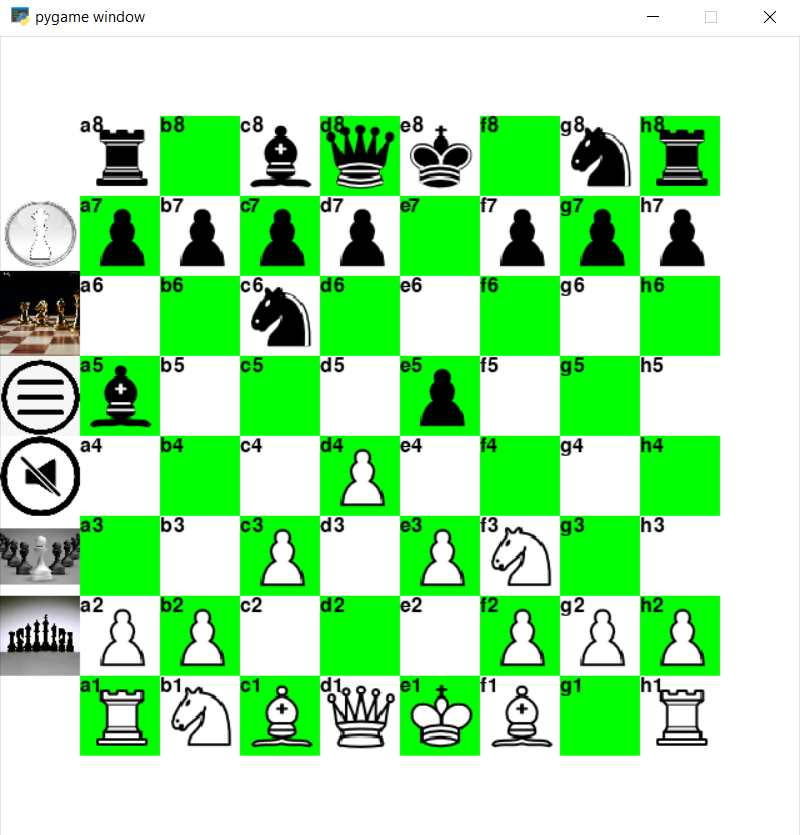
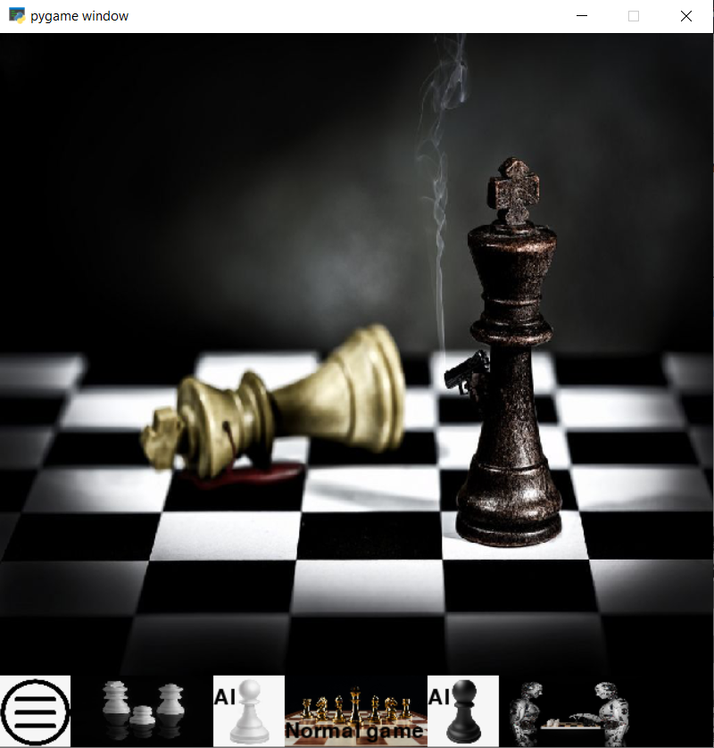
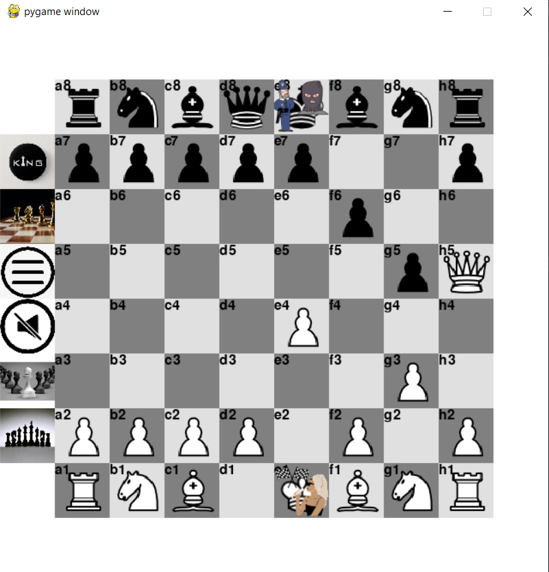

# Chess_Engine

**Artificial Inteligence, Objective oriented programming, python, pygame, numpy, multithreading**

## Overview

A chess game built with Python and Pygame, offering both human vs. human gameplay and AI opponent using alpha-beta pruning search algorithm

## Features and Technical Implementation

- **AI Opponent** -> minimax algorithm with alpha-beta pruning for efficient search
- **position evaluation heuristics** -> heuristics considers:
  - Material value
  - Board control
  - Board center control
  - check and checkmate
- **Multithreaded AI calculation** -> to maintain responsive UI during computer "thinking"
- **Complete Chess Rules Implementation**
  - All standard chess moves including castling, en passant, and pawn promotion
  - The program checks if the king remains under attack after the move, If the king is still in check, the move is removed from the legal moves list
- **Model-View-Controller Pattern**
  - Clear separation between game logic and presentation
  - Separate classes for game state, AI, UI components, and rendering
  - state class encapsulates state of the controler (main.py)
- **User-Friendly Interface**
  - Multiple game modes:
    - Human vs. Human
    - Human vs. AI (white)
    - Human vs. AI (black)
  - Board style customization:
    - button toggling appearance of labels (heuristics evaluation, game mode)
    - button toggling board colors and menu background pictures
    - button toggling appearance of menu icons
    - button toggling fokus on controled squares by black and white
  - Ability to undo moves in human vs. human mode (Right Mouse Click)
  - The game instructions (how to play) with implemented scrolling functionality

## Project Structure

- main.py

 

## Main APP features

1. Undoing a move on rigth click, reseting game
2. Menu - player can choose between normal game or player vs ai, and color agains ai
3. Showing controling squares in game

## Other features

1. Meni icons - when player clicks outside of game board, menu icons show up
2. Check mate animation
3. Changing board stile and menu background picture

## **Thank you for exploring my project!**

If you'd like to learn more about my background and qualifications, please visit my [LinkedIn profile](https://www.linkedin.com/in/jankomitrovic)
