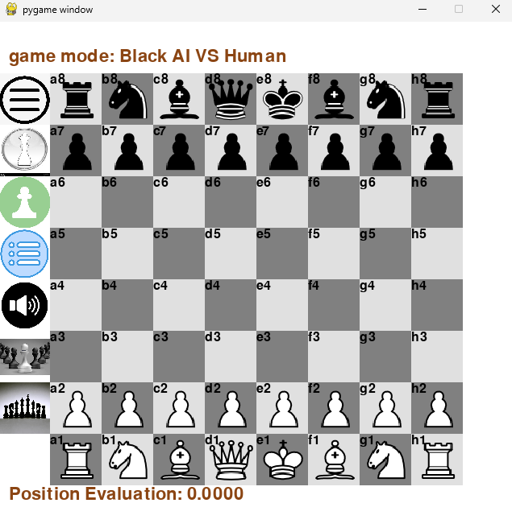
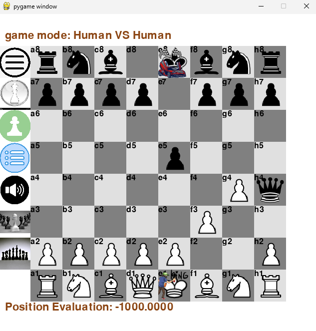
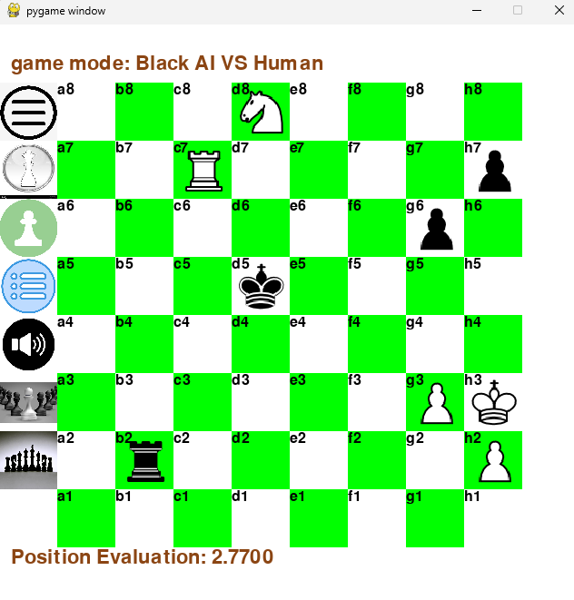
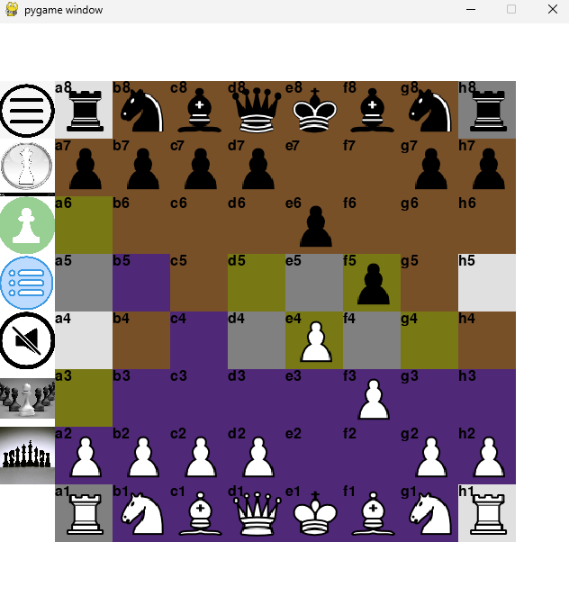
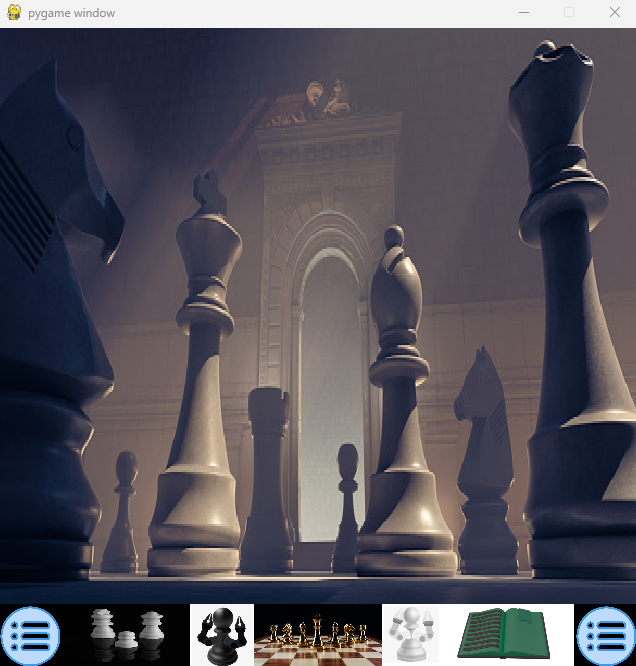
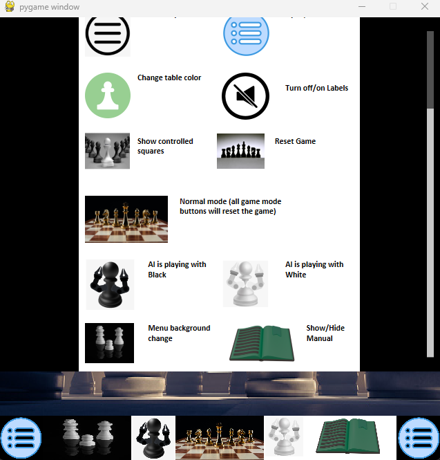

# Chess_Engine

**Artificial Inteligence, Objective oriented programming, python, pygame, numpy, multithreading**

## Overview

A chess game built with Python and Pygame, offering both human vs. human gameplay and AI opponent using alpha-beta pruning search algorithm

## Features and Technical Implementation

- **AI Opponent** -> minimax algorithm with alpha-beta pruning for efficient search
- **position evaluation heuristics** -> heuristics considers:
  - Material value
  - Board control
  - Board center control
  - check and checkmate
- **Multithreaded AI calculation** -> to maintain responsive UI during computer "thinking"
- **Complete Chess Rules Implementation**
  - All standard chess moves including castling, en passant, and pawn promotion
  - The program checks if the king remains under attack after the move, If the king is still in check, the move is removed from the legal moves list
- **Model-View-Controller Pattern**
  - Clear separation between game logic and presentation
  - Separate classes for game state, AI, UI components, and rendering
  - state class encapsulates state of the controler (main.py)
- **User-Friendly Interface**
  - Multiple game modes:
    - Human vs. Human
    - Human vs. AI (white)
    - Human vs. AI (black)
  - Board style customization:
    - button toggling appearance of labels (heuristics evaluation, game mode)
    - button toggling board colors and menu background pictures
    - button toggling appearance of menu icons
    - button toggling fokus on controled squares by black and white
  - Ability to undo moves in human vs. human mode (Right Mouse Click)
  - The game instructions (how to play) with implemented scrolling functionality

## Model-View-Controller (MVC) Pattern

The application follows the Model-View-Controller (MVC) architectural pattern to separate concerns and maintain a clean, maintainable codebase:

### Model (game/)

- **game_state.py**: The core of the chess engine, implementing all chess rules, board representation, move validation, and game state tracking.
- **move.py**: Represents chess moves with their properties, handling special moves like castling, en passant, and pawn promotion.
- **ai_class.py**: Implements the minimax algorithm with alpha-beta pruning for efficient AI move calculation. Uses multithreading to prevent UI freezing during calculations.
- **constants.py**: Contains game-related constants like board dimensions, and configuration settings

### View (ui/)

- **view.py**: Main rendering class responsible for visualizing the game board, pieces, and game state.
- **buttons.py**: Each button on click calls callback that change main_state
- **label.py**: Handles text rendering for game information, status messages
- **manual_viewer.py**: Provides a scrollable interface for displaying game instructions
- **load_images.py**: Utilities for loading and processing graphical assets.

### Controller

- **main.py**: The application entry point that coordinates between Model and View. Handles user input, manages game flow, and updates the display based on game state.
- **ui_state.py**: Encapsulates the state of the controller, tracking UI-specific states like active menu, game mode, and display options

### Supporting Files

- **resources/**: Contains all graphical assets used by the application.
- **RunScripts/**: Convenience batch scripts for launching the application.
- **PresentationResources/**: Materials used for project presentations
- **requirements.txt**: Lists all Python dependencies required by the project.
- **.gitignore**: Specifies files and directories excluded from version control.
- **README.md**: Project documentation including installation instructions, features, and usage guide.

## Project Structure

**Chess_Engine/** 
├── **chess_engine/** # Model - Chess logic and state management 
│ ├── **game_state.py** # Core chess rules, board state and move validation 
│ ├── move.py # Move representation 
│ ├── **ai_class.py** # AI implementation with alpha-beta search 
│ └── constants.py # Game-related constants and configurations 
├── **user_interface/** # View - User interface components 
│ ├── **view.py** - # Main visualization class 
│ ├── buttons.py # Interactive UI elements 
│ ├── label.py # Text rendering components 
│ ├── load_images.py # Resource loading utilities 
│ └── manual_viewer.py # Scrollable instructions viewer 
├── **main.py** # Application entry point and controller 
├── **main_state.py** # Encapsulates the state of the controller  
├── Resources/ # Assets including images and sounds 
├── RunScripts/ # Batch scripts for easy application launch 
├── PresentationResources/ # Project presentation materials 
├── .gitignore # Git ignore file 
├── requirements.txt # Project dependencies 
└── README.md # Project documentation 

## Presentation

- **gameplay**

- **style customization**

- **menu**

## Visual instructions - **how to play**

## Video Presentation (GIF)

## **Thank you for exploring my project!**

If you'd like to learn more about my background and qualifications, please visit my [LinkedIn profile](https://www.linkedin.com/in/jankomitrovic)
