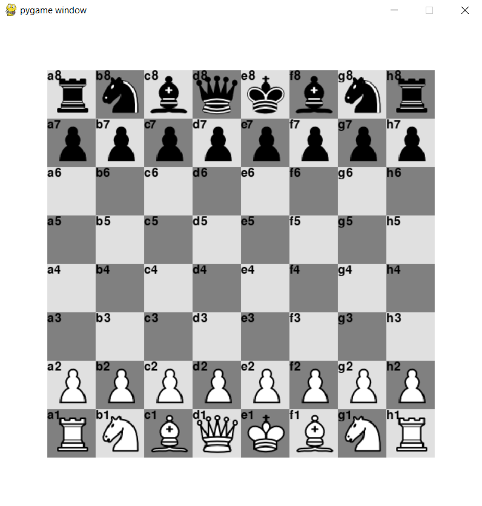
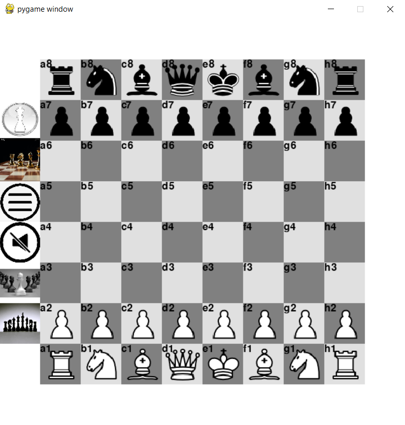
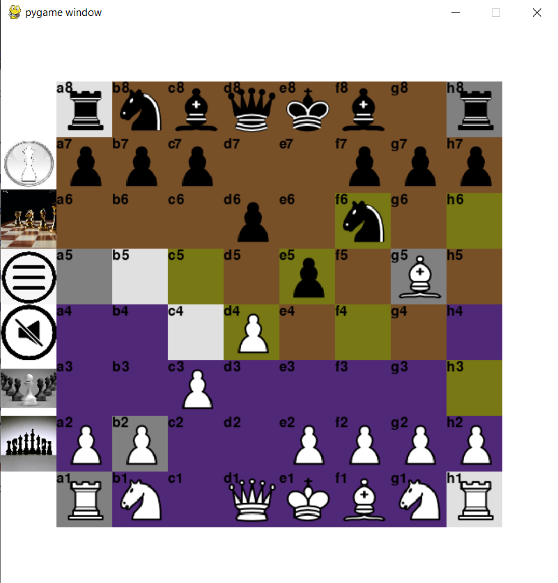
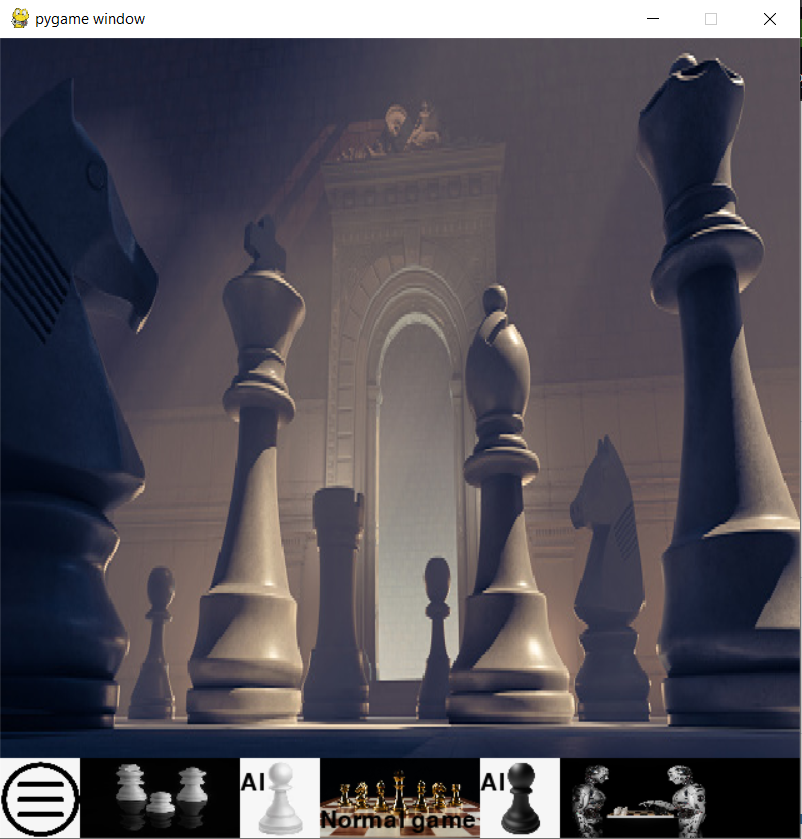

# Chess_Engine
**Artificial Inteligence, Objective oriented programming, python - pygame**

## essentials
- implementing **alpha-beta-pruning** algorithm on game tree, for the purpose of finding best move for ai player on every move
- implementing search on game tree in the purpose of funding **valid moves** for every move in the game

## Main Game featres
1. Two player game - classic
2. Ai vs player

 

## Main APP features
1. Meni icons - when player clicks outside of game board, menu icons show up
2. Menu - player can choose between normal game or player vs ai, and color agains ai
3. Changing menu background picture, showing controling squares in game
4. Undoing a move on rigth click, reseting game

 

## Future Features
1. Ai vs Ai for comparison of different heuristics for evaluating position
2. Check mate animation 
3. Sound

